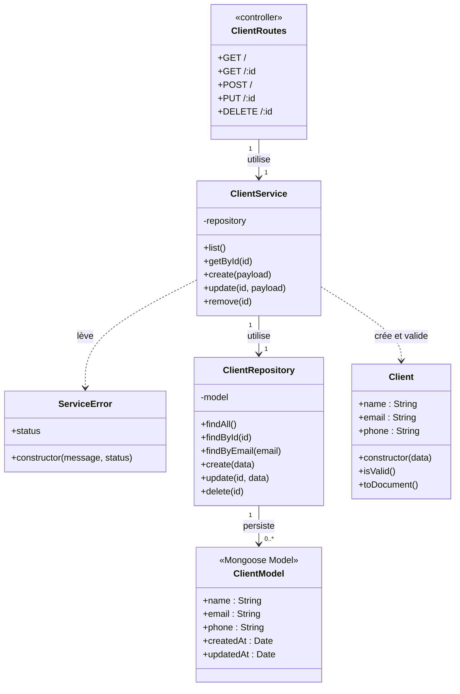

# Diagramme UML — Service Client

Ce diagramme représente les classes et modules utilisés par le service Client.

## Responsabilités principales

- `Client` contient les données métier et valide le nom, le courriel et le téléphone.
- `ClientService` applique les règles métier, notamment l'unicité du courriel.
- `ClientRepository` encapsule l'accès à MongoDB par Mongoose.
- `ClientRoutes` joue le rôle de contrôleur HTTP du service.
