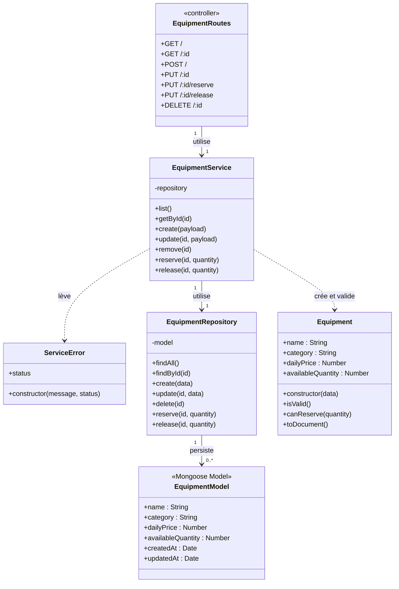

# Diagramme UML — Service Matériel

Ce diagramme représente les classes et modules utilisés par le service Matériel.

## Responsabilités principales

- `Equipment` contient les informations du matériel et les règles de validation du stock.
- `EquipmentService` gère le CRUD, la réservation du stock et sa remise en disponibilité.
- `EquipmentRepository` effectue les opérations MongoDB, y compris les ajustements atomiques de quantité.
- `EquipmentRoutes` joue le rôle de contrôleur HTTP du service.
