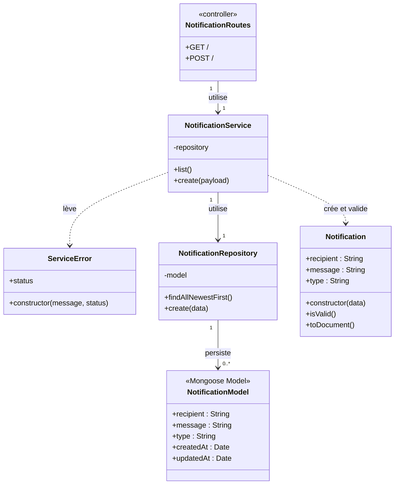

# Diagramme UML — Service Notification

Ce diagramme représente les classes et modules utilisés par le service Notification.

## Responsabilités principales

- `Notification` contient le destinataire, le message et le type de notification.
- `NotificationService` valide puis enregistre les notifications.
- `NotificationRepository` récupère les notifications de la plus récente à la plus ancienne et les persiste dans MongoDB.
- `NotificationRoutes` joue le rôle de contrôleur HTTP.
