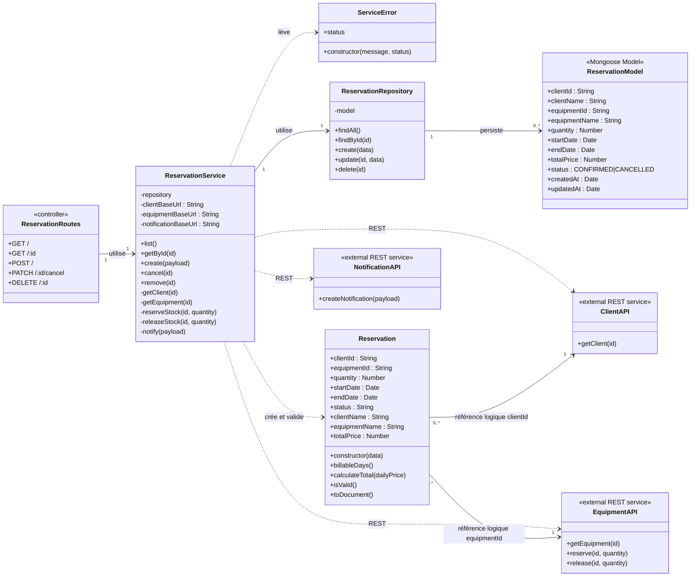

# Diagramme UML — Service Réservation

Ce diagramme représente les classes du service Réservation et ses dépendances REST vers les autres services.

## Responsabilités principales

- `Reservation` valide les identifiants, la quantité et les dates, puis calcule le nombre de jours facturables et le prix total.
- `ReservationService` orchestre la création et l'annulation d'une réservation.
- Le service Réservation vérifie le client et le matériel par REST.
- Il réserve ou libère le stock par le service Matériel.
- Il crée une notification après confirmation ou annulation.
- `ReservationRepository` persiste les réservations dans MongoDB.

> Les relations avec `ClientAPI` et `EquipmentAPI` sont des références logiques entre microservices : la réservation conserve des identifiants (`clientId`, `equipmentId`) plutôt qu'une relation MongoDB directe.
